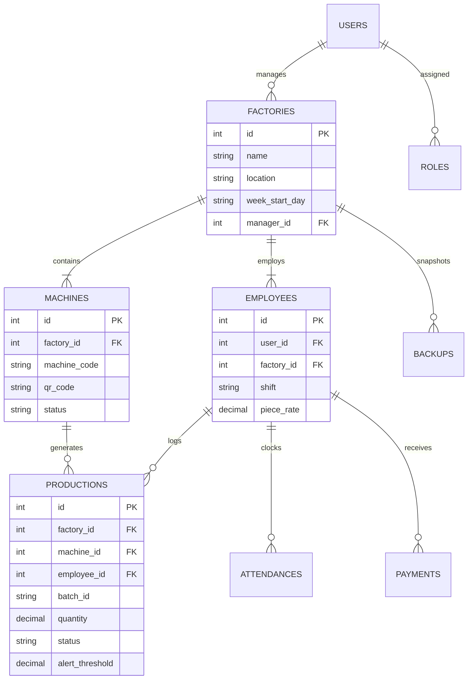

<div align="center">

  # 🧵 TechStile Backend API

  <p align="center">
    <strong>RESTful API & Industrial Engine for TechStile Smart Textile Factory Management System</strong>
  </p>

  <p align="center">
    <a href="https://laravel.com/"></a>
    <a href="https://www.php.net/"></a>
    <a href="https://www.mysql.com/"></a>
    <a href="https://laravel.com/docs/sanctum"></a>
    <a href="https://spatie.be/docs/laravel-permission"></a>
  </p>

</div>

---

## 📌 About TechStile Backend

The **TechStile Backend** powers the **TechStile Production Management System**, serving as the central RESTful API gateway and business logic controller for textile mills, looms, and manufacturing plants. It handles role-based authorization, machine inventory management, QR-code data binding, real-time batch production approvals, attendance records, payroll calculations, and database backup routines.

---

## 🏗️ Architecture & Data Relations



---

## ⚙️ Core Modules & Endpoints

### 1. 🔐 Authentication & Profile
- `POST /api/login` — User authentication & Sanctum token issue
- `POST /api/forgot-password` — Password recovery dispatch
- `POST /api/change-password` — Security credential update
- `GET  /api/user/profile/{id}` — Retrieve profile & role metadata

### 2. 🏭 Multi-Factory & Role Management (Owner Only)
- `GET    /api/factories/allfactories` — List all registered factories
- `POST   /api/factories/addfactory` — Register a new factory plant
- `GET    /api/factories/dashboard/{id}` — Factory performance metrics
- `GET    /api/roles/all` & `POST /api/roles/add` — Role definition (Spatie RBAC)
- `POST   /api/permissions/sync` — Synchronize permissions across roles

### 3. 🧵 Machine Inventory & QR Assignment
- `GET    /api/machines/all/{factoryId}` — List machines with operational status
- `POST   /api/machines/add_machine` — Register industrial machine & generate QR
- `POST   /api/assign-machines` — Allocate machines to operators/shifts
- `GET    /api/employee/machine-details/{id}` — Query machine details via QR scan

### 4. 📊 Production & Approval Pipeline
- `POST   /api/productions/add_production` — Operator logs new production batch
- `GET    /api/manager/productions/{factoryId}` — Manager queue of pending batches
- `POST   /api/manager/productions/{id}/action` — Manager approval/rejection
- `GET    /api/owner/productions/{factoryId}` — Owner oversight and audit
- `POST   /api/owner/productions/{id}/action` — Owner final authorization

### 5. 👥 Attendance, Wages & Payments
- `POST   /api/attendence/mark_attendance` — Shift clock-in/out
- `GET    /api/employees-with-shift/{factoryId}` — Active shift roster
- `GET    /api/employees/{id}/earned-amount` — Calculated wages from approved batches
- `GET    /api/payments/view-payments/{factoryId}` — Payment disbursements

### 6. 🗄️ System Backup & Settings
- `GET    /api/backups` — List database snapshots
- `POST   /api/backups` — Trigger immediate backup snapshot
- `POST   /api/backups/toggle` — Automated backup configuration
- `POST   /api/backups/{id}/restore` — Restore point recovery

---

## 🚀 Setup & Installation

### 1. Clone & Install Dependencies
```bash
cd techbackendirha
composer install
```

### 2. Configure Environment
```bash
cp .env.example .env
php artisan key:generate
```

Configure your `.env` database parameters:
```env
DB_CONNECTION=mysql
DB_HOST=127.0.0.1
DB_PORT=3306
DB_DATABASE=techbackendirha
DB_USERNAME=root
DB_PASSWORD=
```

### 3. Run Migrations & Seeders
```bash
php artisan migrate --seed
```

### 4. Run API Server
```bash
php artisan serve
```

---

## 📄 License

This project is licensed under the [MIT License](LICENSE).
